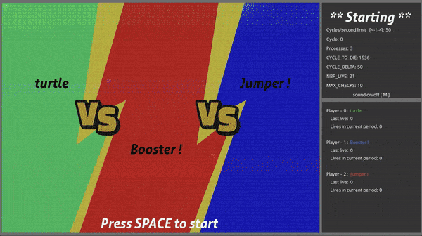

# CoreWar

## Goal of CoreWar project

To write interpreter for pseudo-assembler language, write virtual machine for this language and make the breathtaking visualisation CoreWar game.

## How to Run this
To run Assembly language interpreter:
```
./asm [input files]
	input files - correct *.s file written in Assembly language
```
To run CoreWar game without visualisation:
```
./corewar [args...][-n][number][filename.cor]|[filename.cor]
	s - silent. No live operation prints
	help - help message
	[-n][number] - set player's number to [number]
	[filename.cor] - path to champion.
```
To run breathtaking CoreWar game:
```
./visu	[args...][-n][number][filename.cor]|[filename.cor]
	s - silent. No live operation prints
	help - help message
	[-n][number] - set player's number to [number]
	[filename.cor] - path to champion.
```
## How its look like?



## Prerequisites to rebiuld programs

You have to install graphics libraries as in <a href="http://lazyfoo.net/tutorials/SDL/01_hello_SDL/mac/index.php"> this instructions </a> to ~/Library/Frameworks/

```
SDL2        
SDL2_image  
SDL2_ttf    
```

You have to upload .c and .h files from <a href="http://www.ferzkopp.net/wordpress/2016/01/02/sdl_gfx-sdl2_gfx/">this source</a> to ~/SDL_gfx/
```
SDL_gfx
```
